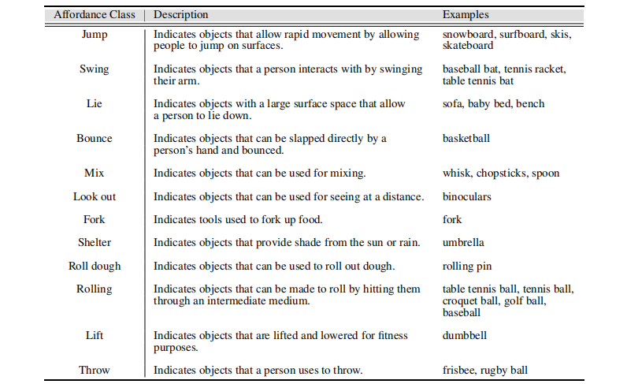
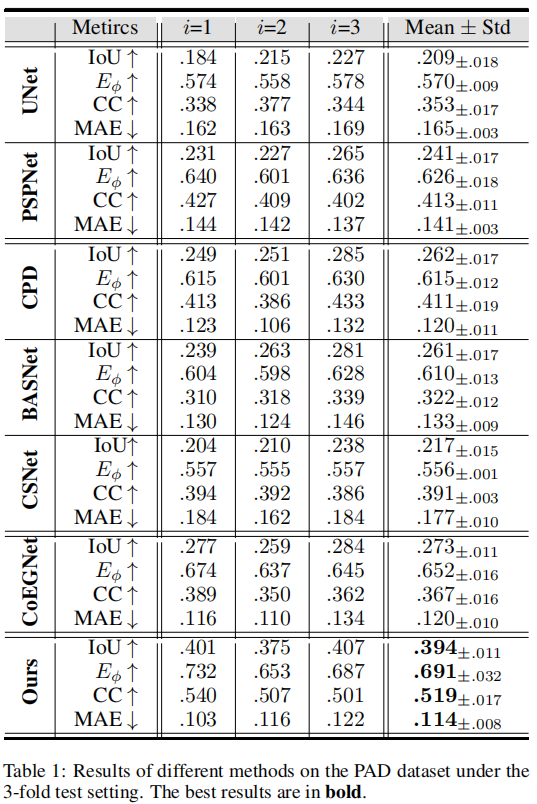
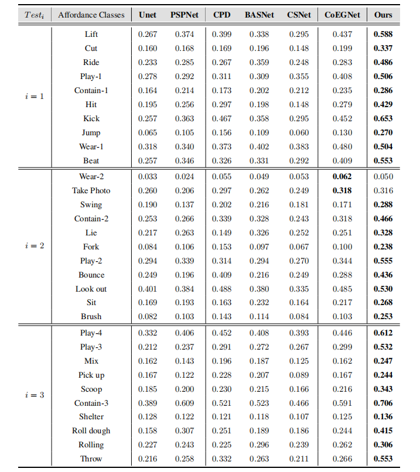

# One-Shot Affordance Detection
[[code]()]
[[paper]()]
[[supp]()]
[[dataset]()]
[[results]()]
[[tools]()]
> Authors:
> [Hongchen Luo](),

## Abstract
Affordance detection refers to identifying the potential action possibilities of objects in an image, which is an important ability for robot perception and manipulation. To empower robots with this ability in unseen scenarios, we consider the challenging one-shot affordance detection problem in this paper, i.e., given a support image that depicts the action purpose, all objects in a scene with the common affordance should be detected. To this end, we devise a One-Shot Affordance Detection (OS-AD) network that firstly estimates the purpose and then transfers it to help detect the common affordance from all candidate images. Through collaboration learning, OS-AD can capture the common characteristics between objects having the same underlying affordance and learn a good adaptation capability for perceiving unseen affordances. Besides, we build a Purpose-driven Affordance Dataset (PAD) by collecting and labeling 4K images from 31 affordance and 72 object categories. Experimental results demonstrate the superiority of our model over previous representative ones in terms of both objective metrics and visual quality. The code and dataset will be released.

## Dataset(PADv2)

      
    <em> 
    </em>

2.[project](http://users.umiacs.umd.edu/~amyers/part-affordance-dataset/)
4.[project](https://sites.google.com/site/ocnncrf/)
5.[project](http://sor3d.vcl.iti.gr/)
6.[project](http://www.cs.utoronto.ca/~cychuang/learning2act/)
7.[project](https://lhc1224.github.io/lhc.github.io/)

      
    <em> 
    Figure 1: The classification system and statistics of the Purpose-driven Affordance Dataset (PAD), which contains 4,002 images covering 72 object classes and 31 affordance classes.
    </em>

      
    <em> 
    Figure 2: The word cloud composition of the PAD dataset.
    </em>

      
    <em> 
    Figure 3: Example of our PAD dataset.
    </em>

      
    <em> 
    Figure 4: Definition of each affordance in our PAD dataset and the class of objects it contains (1/2).
    </em>

      
    <em> 
    Figure 5: Definition of each affordance in our PAD dataset and the class of objects it contains (2/2).
    </em>

## Dataset Divide 
You can download the dataset from [Baidu Pan]()

      
    <em> 
    Figure 6:  The specific affordance category contained in the test set in the threefold setting.
    </em>

## Results
You can download the affordance maps from [Baidu Pan]()

      
    <em>
    </em>

      
    <em>
    </em>

      
    <em>
    </em>

      
    <em>
    </em>

                                          

      
    <em>
    </em>

      
    <em>
    </em>

      
    <em>
    </em>

      
    <em>
    </em>

## Citation
